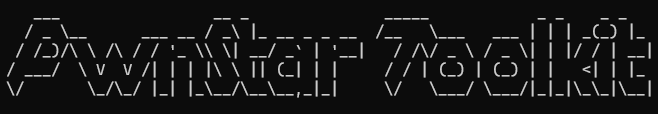

  <a href="./public/toolkit.png" target="_blank">
    
     
      
</a>

# PwnStar-Toolkit

**PwnStar-Toolkit** is a lightweight command-line toolkit designed for **CTF enthusiasts** and security researchers. It helps you quickly **decode classical ciphers**, **crack hashes**, and automate common crypto and reversing tasks.

---
## Features

- 🔑 Decode classical ciphers: Vigenère, Caesar, ROT13, etc.  
- 🛡️ Crack common hash types: MD5, SHA256, and more.
- ⚡ Fast CLI interface for quick usage  
- 📂 Easy integration into automated CTF workflows

